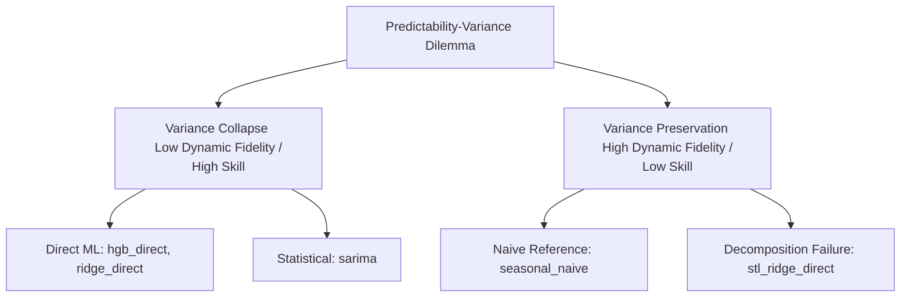

# Five-Model Scientific Story Decision Audit

This document presents a comprehensive diagnostic analysis of the five-model run (`hgb_direct`, `ridge_direct`, `sarima`, `seasonal_naive`, `stl_ridge_direct`) on PM10 forecasting across 17 stations and 7 forecast horizons (119 cells per model). It evaluates whether the scientific story of the paper should be reframed around model-family failure modes.

---

## A. Verified Model List
The five models included in the new run are successfully verified:
1. **hgb_direct** (Direct ML) — Gradient boosted regression trees predicting horizons directly.
2. **ridge_direct** (Direct ML) — Regularized linear regression predicting horizons directly.
3. **sarima** (Statistical baseline) — Classical seasonal autoregressive integrated moving average baseline.
4. **seasonal_naive** (Variance-preserving naive) — Baseline forecasting using seasonal persistence, which preserves variance by definition.
5. **stl_ridge_direct** (Decomposition + Ridge) — STL decomposition coupled with Ridge direct regression on components, designed to preserve dynamic variance.

---

## B. Key Collapse Rates
The table below highlights the computed collapse rates (fraction of station-horizon cells where variance retention $\alpha < 0.5$):

| Model | Model Family | Median Skill | Median $\alpha$ | Collapse Rate (\%) | Retained Rate (\%) |
| :--- | :--- | :---: | :---: | :---: | :---: |
| **hgb_direct** | Direct ML | 0.2046 | 0.1506 | 99.2\% | 0.0\% |
| **ridge_direct** | Direct ML | 0.2190 | 0.0874 | 99.2\% | 0.0\% |
| **sarima** | Statistical baseline | 0.2077 | 0.0951 | 92.4\% | 0.0\% |
| **seasonal_naive** | Variance-preserving naive | -0.0262 | 0.9998 | 0.0\% | 98.3\% |
| **stl_ridge_direct** | Decomposition + Ridge | -1.1072 | 1.3987 | 0.0\% | 100.0\% |

---

## C. Characterization of STL+Ridge
> [!IMPORTANT]
> **STL+Ridge is a variance-preserving but catastrophically low-skill reference model.**
> It is **not** a true "skill + retained variance" model. While it successfully preserves dynamic variance (median $\alpha = 1.3987$ and $0.0\%$ collapse rate), it achieves a median skill of **-1.1072**, meaning it performs substantially worse than simple persistence (skill = 0.0) in all 119 cells. 

---

## D. Characterization of SARIMA
> [!NOTE]
> **SARIMA behaves exactly like the collapsed direct models (HGB and Ridge).**
> It has a median $\alpha$ of **0.0951** and collapses variance in **92.4\%** of the cells. This indicates that variance collapse is not a failure mode unique to machine learning models (HGB/Ridge); rather, it is a fundamental consequence of any statistical or mathematical model optimized under a Mean Squared Error (MSE) loss function attempting to forecast high-frequency variations with limited predictability.

---

## E. Recommended Revised Paper Story
We strongly recommend upgrading the paper's scientific story from "direct ML collapses variance" to a much more general and profound message: **The Predictability-Variance Dilemma**. 
The revised story argues that under standard MSE training/optimization, any model trying to predict high-uncertainty PM10 concentrations (whether flexible machine learning like HGB, linear regularized models like Ridge, or classical statistical systems like SARIMA) will inevitably collapse forecast variance to the mean to minimize squared errors, losing the dynamic fidelity of extreme events. Attempts to force variance preservation through pre-decomposition (STL+Ridge) succeed in restoring dynamic variance but suffer a catastrophic loss of forecasting skill due to systematic reconstruction biases (additive bias) and conditional mismatches. This establishes that variance retention and deterministic forecasting skill represent a fundamental trade-off that standard optimization cannot bridge.

---

## F. Recommended Main-Text Additions

### 1. Proposed Table
We recommend replacing the previous 3-model table in the main text with the new 5-model synthesis table generated by this pipeline. (See outputs/tables/model_family_diagnostic_summary.tex).

### 2. Proposed Figure
We recommend a new dual-panel dashboard figure:
- **Panel A**: A scatter plot of Median Skill vs. Median Alpha (Variance Retention) for all 5 models. This visually maps the "Predictability-Variance frontier", demonstrating that direct ML/SARIMA cluster in the "high-skill, collapsed variance" quadrant, seasonal naive sits in the "no-skill, perfect variance" zone, and STL+Ridge falls into the "catastrophic negative-skill, inflated variance" territory.
- **Panel B**: A threshold exceedance curves panel showing CSI (y-axis) vs. PM10 Threshold (x-axis, abs_50, p75, p90). This highlights that while STL+Ridge has extremely high recall (0.895), its CSI is low (0.104) due to a massive false alarm rate (0.896), showing it is a false positive machine.

### 3. Proposed Discussion Paragraph
> [!TIP]
> **Proposed Text for Section 5 (Discussion):**
> "The introduction of statistical baselines (SARIMA) and hybrid decomposition methods (STL+Ridge) reveals that the variance-collapse phenomenon is not an architectural defect unique to direct machine learning models. Instead, it is an optimal statistical strategy under Mean Squared Error (MSE) loss: when forecasting horizons with low predictability, any model that attempts to predict actual values will suppress dynamic variance (SARIMA collapse rate: 92.4\%, HGB: 99.2\% ) to minimize variance in the error terms. Forcing the model to preserve dynamic fluctuations via additive decomposition (STL+Ridge) fails catastrophically (median skill: -1.1072). Murphy decomposition analysis reveals that this failure is driven by a massive systematic unconditional bias (median $\text{Bias}^2 = 445.86$ compared to 0.29 for HGB) combined with severe conditional bias (median $\text{Cond. Bias}^2 = 94.47$). This confirms that restoring dynamical variance in deterministic systems without a corresponding increase in true correlation simply replaces variance collapse with systematic and conditional error inflation, leaving the predictability-variance frontier unbroken."

### 4. Placement of Exceedance Diagnostics
Exceedance diagnostics should be **included in the main text** rather than the supplement. Why? Because the extreme difference in exceedance behavior between the collapsed models (HGB median recall: 0.034) and the variance-preserving reference models (STL+Ridge recall: 0.895, but FAR: 0.896) provides the ultimate physical confirmation of the statistical failure modes. It demonstrates that variance collapse directly leads to a complete failure to warn for extreme PM10 episodes (recall near zero), while forced variance preservation leads to warning saturation (FAR near 90%). This makes exceedance metrics crucial to the primary scientific argument.

